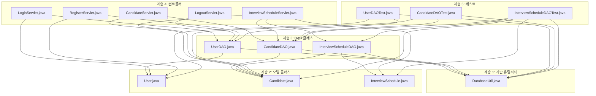

# Maven 기반 프로젝트 의존성 맵

## 1. 프로젝트 구조

```
ATS/
├── pom.xml                    # Maven 설정 파일
├── mvnw.cmd                   # Windows용 Maven Wrapper
├── .mvn/
│   └── wrapper/
│       └── maven-wrapper.properties
├── src/                       # Java 소스 코드
│   └── com/example/
│       ├── util/              # 유틸리티 클래스
│       │   └── DatabaseUtil.java
│       ├── model/             # 모델 클래스 (Entity + DAO)
│       │   ├── User.java
│       │   ├── UserDAO.java
│       │   ├── Candidate.java
│       │   ├── CandidateDAO.java
│       │   ├── InterviewSchedule.java
│       │   └── InterviewScheduleDAO.java
│       └── controller/        # 서블릿 컨트롤러
│           ├── LoginServlet.java
│           ├── LogoutServlet.java
│           ├── RegisterServlet.java
│           ├── CandidateServlet.java
│           └── InterviewScheduleServlet.java
├── test/                      # JUnit 테스트 코드
│   └── com/example/model/
│       ├── UserDAOTest.java
│       ├── CandidateDAOTest.java
│       └── InterviewScheduleDAOTest.java
├── WEB-INF/                   # 웹 애플리케이션 설정
│   ├── web.xml
│   ├── classes/               # 컴파일된 클래스 (Maven이 자동 관리)
│   └── lib/                   # 라이브러리 (Maven이 자동 관리)
├── css/, *.jsp                # 웹 리소스
└── docs/                      # 프로젝트 문서
```

## 2. Java 클래스 의존성 관계



## 3. Maven 라이브러리 의존성

### 3.1 컴파일 의존성 (compile scope)
```xml
<!-- PostgreSQL JDBC 드라이버 -->
<dependency>
    <groupId>org.postgresql</groupId>
    <artifactId>postgresql</artifactId>
    <version>42.7.7</version>
</dependency>

<!-- BCrypt 비밀번호 해싱 -->
<dependency>
    <groupId>org.mindrot</groupId>
    <artifactId>jbcrypt</artifactId>
    <version>0.4</version>
</dependency>

<!-- JSTL -->
<dependency>
    <groupId>javax.servlet</groupId>
    <artifactId>jstl</artifactId>
    <version>1.2</version>
</dependency>
```

### 3.2 제공된 의존성 (provided scope)
```xml
<!-- Servlet API (Tomcat에서 제공) -->
<dependency>
    <groupId>javax.servlet</groupId>
    <artifactId>javax.servlet-api</artifactId>
    <version>4.0.1</version>
    <scope>provided</scope>
</dependency>

<!-- JSP API (Tomcat에서 제공) -->
<dependency>
    <groupId>javax.servlet.jsp</groupId>
    <artifactId>javax.servlet.jsp-api</artifactId>
    <version>2.3.3</version>
    <scope>provided</scope>
</dependency>
```

### 3.3 테스트 의존성 (test scope)
```xml
<!-- JUnit 테스트 프레임워크 -->
<dependency>
    <groupId>junit</groupId>
    <artifactId>junit</artifactId>
    <version>4.13.2</version>
    <scope>test</scope>
</dependency>

<!-- Hamcrest Core (JUnit 어설션) -->
<dependency>
    <groupId>org.hamcrest</groupId>
    <artifactId>hamcrest-core</artifactId>
    <version>1.3</version>
    <scope>test</scope>
</dependency>
```

## 4. Maven 컴파일 순서

Maven은 자동으로 의존성을 분석하여 컴파일 순서를 결정하지만, 명시적으로 순서를 보장하기 위해 다음과 같이 설정:

```xml
<plugin>
    <groupId>org.apache.maven.plugins</groupId>
    <artifactId>maven-compiler-plugin</artifactId>
    <configuration>
        <includes>
            <include>com/example/util/**/*.java</include>    <!-- 1순위: 유틸리티 -->
            <include>com/example/model/**/*.java</include>   <!-- 2순위: 모델 -->
            <include>com/example/controller/**/*.java</include> <!-- 3순위: 컨트롤러 -->
        </includes>
    </configuration>
</plugin>
```

## 5. Maven 주요 명령어

### 5.1 프로젝트 정리 및 컴파일
```bash
# 이전 빌드 결과물 정리
mvnw.cmd clean

# 컴파일만 실행
mvnw.cmd compile

# 테스트 컴파일 포함
mvnw.cmd test-compile
```

### 5.2 테스트 실행
```bash
# 모든 테스트 실행
mvnw.cmd test

# 특정 테스트 클래스만 실행
mvnw.cmd test -Dtest=UserDAOTest
mvnw.cmd test -Dtest=CandidateDAOTest
mvnw.cmd test -Dtest=InterviewScheduleDAOTest

# 테스트 건너뛰고 패키징
mvnw.cmd package -DskipTests
```

### 5.3 패키징 및 배포
```bash
# WAR 파일 생성
mvnw.cmd package

# WAR 파일이 target/ 디렉터리에 생성됨
# target/promptsharing-jsp-1.3.0.war
```

### 5.4 개발 서버 실행
```bash
# Tomcat 내장 서버로 실행
mvnw.cmd tomcat7:run

# 브라우저에서 접속: http://localhost:8080/ATS
```

## 6. 기존 javac와 Maven 비교

### 6.1 기존 방식 (javac)
```bash
# 복잡한 classpath 설정 필요
javac -cp ".;WEB-INF/lib/*;C:/tomcat9/lib/servlet-api.jar" -d WEB-INF/classes src/com/example/*/*.java

# 의존성 순서 수동 관리
javac -cp ".;WEB-INF/lib/*;C:/tomcat9/lib/servlet-api.jar" -d WEB-INF/classes src/com/example/util/DatabaseUtil.java
javac -cp ".;WEB-INF/lib/*;C:/tomcat9/lib/servlet-api.jar" -d WEB-INF/classes src/com/example/model/*.java
javac -cp ".;WEB-INF/lib/*;C:/tomcat9/lib/servlet-api.jar" -d WEB-INF/classes src/com/example/controller/*.java
```

### 6.2 Maven 방식
```bash
# 단순한 명령어로 모든 작업 처리
mvnw.cmd compile

# 의존성 자동 다운로드 및 관리
# 컴파일 순서 자동 분석
# 테스트 자동 실행
# WAR 파일 자동 생성
```

## 7. IDE 통합

### 7.1 IntelliJ IDEA
- `pom.xml` 파일을 열고 "Import as Maven Project" 선택
- 자동으로 의존성 다운로드 및 프로젝트 구조 인식

### 7.2 Eclipse
- `File > Import > Existing Maven Projects` 선택
- 프로젝트 루트 디렉터리 지정

### 7.3 VS Code
- Java Extension Pack 설치
- 프로젝트 폴더 열기 시 자동으로 Maven 프로젝트 인식

## 8. 혜택

1. **의존성 관리 자동화**: 라이브러리 버전 관리 및 충돌 해결
2. **표준화된 프로젝트 구조**: 팀 개발 시 일관성 확보
3. **빌드 자동화**: 컴파일, 테스트, 패키징을 한 번에 처리
4. **IDE 통합**: 대부분의 IDE에서 바로 인식 및 지원
5. **CI/CD 통합**: Jenkins, GitHub Actions 등과 쉽게 연동
6. **환경별 설정**: dev, prod 환경별 다른 설정 적용 가능

## 9. 마이그레이션 가이드

기존 javac 방식에서 Maven으로 마이그레이션하려면:

1. `pom.xml` 파일을 프로젝트 루트에 배치
2. Maven Wrapper 파일들 추가 (`mvnw.cmd`, `.mvn/`)
3. 기존 라이브러리 제거 후 Maven 의존성으로 대체
4. `mvnw.cmd clean compile` 실행하여 정상 동작 확인
5. 기존 배치 스크립트를 Maven 명령어로 교체

이제 `javac` 대신 `mvnw.cmd compile`을 사용하여 동일한 결과를 더 간단하고 안정적으로 얻을 수 있습니다. 