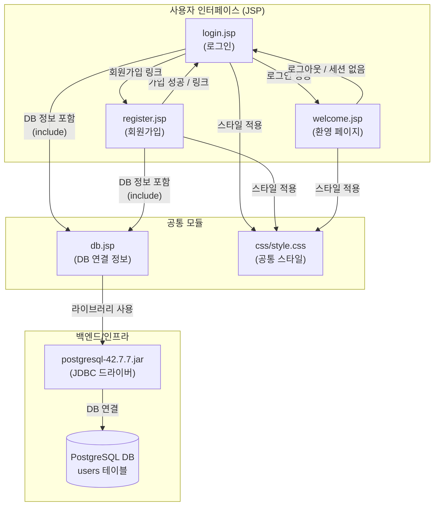

<!-- Generated by SpecStory -->

# 이전 채팅 기록 요청 (2025-06-19 14:41:44)

_**User**_

이전 채팅기록 보여줘

---

_**Assistant**_

이전 채팅 기록은 현재 이 대화 세션에서만 확인할 수 있습니다. 만약 이전에 진행했던 다른 대화(세션)의 기록을 보고 싶으시다면, 해당 기록은 이 창에서는 직접 제공해드릴 수 없습니다.

하지만, 이 세션에서 진행된 대화 내용은 아래와 같습니다:

1. 현재 작업 중인 프로젝트의 파일 구조와 OS 정보가 공유되었습니다.
2. `register.jsp` 파일 전체 코드가 첨부되었습니다.
3. "이전 채팅기록 보여줘"라는 요청이 들어왔습니다.

이전 세션의 대화 내용이 필요하시다면, 사용하신 플랫폼(예: Cursor, ChatGPT, 기타 AI 서비스)의 대화 기록 기능을 확인해 주세요.  
현재 이 세션 내에서 진행된 내용이 더 필요하시면 언제든 말씀해 주세요!

---

_**User**_

이전 채팅 기록 보여줘

---

_**Assistant**_

현재 이 대화 세션에서 진행된 채팅 기록은 아래와 같습니다:

---
1. 프로젝트의 파일 구조와 환경 정보가 공유되었습니다.
2. `register.jsp` 파일 전체 코드가 첨부되었습니다.
3. "이전 채팅기록 보여줘"라는 요청이 있었습니다.
---

이전(다른 세션)의 채팅 기록은 이 창에서 직접 제공해드릴 수 없습니다.  
이 세션 내에서 진행된 대화 내용이 필요하시면 언제든 말씀해 주세요!

---

_**User**_

1. 이 프로젝트를 분석하고 문맥을 이해.
2. 프로젝트의 구조 설명

---

_**Assistant**_

프로젝트 분석 및 문맥 이해

### 1. 프로젝트 분석 및 문맥 이해

이 프로젝트는 JSP(JavaServer Pages) 기반의 간단한 웹 애플리케이션으로, 회원가입 및 로그인을 지원하는 기능을 가지고 있습니다.  
주요 특징은 다음과 같습니다:

- **JSP 파일 사용**: 프론트엔드와 백엔드가 한 파일에서 처리되는 전형적인 JSP 구조입니다.
- **PostgreSQL 데이터베이스 연동**: `WEB-INF/lib/postgresql-42.7.7.jar` 드라이버가 포함되어 있어, PostgreSQL DB와 연동합니다.
- **회원가입 기능**:  
  - `register.jsp`에서 아이디와 비밀번호를 입력받아 DB에 저장합니다.
  - 이미 존재하는 아이디에 대한 예외 처리, 입력값 검증, DB 오류 처리 등이 구현되어 있습니다.
- **로그인 기능**:  
  - `login.jsp` 파일이 존재하며, 로그인 폼 및 인증 처리가 이루어질 것으로 예상됩니다.
- **DB 연결 정보**:  
  - `db.jsp` 파일에서 DB 연결 정보(예: url, dbUser, dbPass 등)를 관리합니다.
- **회원가입 성공 시 로그인 페이지로 리다이렉트**:  
  - 회원가입이 성공하면 `login.jsp`로 이동합니다.

---

### 2. 프로젝트의 구조 설명

아래는 프로젝트의 디렉터리 및 파일 구조와 각 파일의 역할입니다.

```
PromptSharing3_JSP/
│
├── db.jsp                # DB 연결 정보 및 공통 DB 관련 코드 포함
├── login.jsp             # 로그인 폼 및 인증 처리 JSP
├── register.jsp          # 회원가입 폼 및 회원정보 DB 저장 JSP
├── welcome.jsp           # 로그인 후 또는 메인 페이지로 예상되는 JSP
│
└── WEB-INF/
    └── lib/
        └── postgresql-42.7.7.jar   # PostgreSQL JDBC 드라이버
```

#### 각 파일 설명

- **db.jsp**  
  데이터베이스 연결에 필요한 정보(접속 URL, 사용자명, 비밀번호 등)를 정의하고, 다른 JSP 파일에서 include하여 사용합니다.

- **register.jsp**  
  회원가입 폼을 제공하고, POST 요청 시 입력값을 검증하여 DB에 새로운 사용자를 추가합니다.  
  예외 처리(중복 아이디, DB 오류 등)도 포함되어 있습니다.

- **login.jsp**  
  로그인 폼을 제공하며, 사용자의 인증을 처리합니다. (구체적 로직은 파일을 열어봐야 알 수 있습니다.)

- **welcome.jsp**  
  로그인 성공 후 이동하는 환영 페이지 또는 메인 페이지로 추정됩니다.

- **WEB-INF/lib/postgresql-42.7.7.jar**  
  PostgreSQL 데이터베이스와 연동하기 위한 JDBC 드라이버입니다.

---

#### 요약

이 프로젝트는 JSP와 PostgreSQL을 이용한 기본적인 회원가입/로그인 웹 애플리케이션입니다.  
각 JSP 파일이 각각의 역할(회원가입, 로그인, DB 연결 등)을 담당하며, DB 연동을 위해 JDBC 드라이버가 포함되어 있습니다.

더 궁금한 점이나 특정 파일의 상세 분석이 필요하시면 말씀해 주세요!

---

_**User**_

에서 톰캣 콘솔에서 글자가 깨짐. 문제해결

---

_**Assistant**_

JSP에서 한글(또는 UTF-8 문자)이 톰캣 콘솔에 출력될 때 글자가 깨지는 문제는 주로 **콘솔의 인코딩 설정**과 **JVM 옵션**이 맞지 않아서 발생합니다.

### 원인
- `System.out.println()`으로 출력되는 문자열이 UTF-8로 인코딩되지 않고, 기본 시스템 인코딩(CP949, EUC-KR 등)으로 출력되어 한글이 깨집니다.
- Windows의 기본 콘솔 인코딩이 UTF-8이 아닐 수 있습니다.

---

## 해결 방법

### 1. JVM 옵션에 UTF-8 인코딩 추가

**Tomcat 실행 시 JVM 옵션에 아래를 추가하세요:**
```
-Dfile.encoding=UTF-8
```

#### 방법
- Tomcat을 서비스로 실행 중이라면, `setenv.bat` 파일(없으면 새로 만드세요)에 아래 내용 추가:
  ```
  set JAVA_OPTS=%JAVA_OPTS% -Dfile.encoding=UTF-8
  ```
- 또는 Eclipse/IntelliJ에서 Tomcat을 실행한다면, VM 옵션에 `-Dfile.encoding=UTF-8` 추가

---

### 2. Windows 콘솔(cmd, PowerShell) 인코딩 변경

**PowerShell에서:**
```powershell
chcp 65001
```
- 이 명령어로 콘솔의 코드 페이지를 UTF-8(65001)로 변경합니다.

**cmd에서:**
```cmd
chcp 65001
```

---

### 3. IDE 콘솔 인코딩 설정 (Eclipse/IntelliJ 등)

- IDE의 콘솔 인코딩을 UTF-8로 맞추세요.
  - Eclipse: Preferences > General > Workspace > Text file encoding: UTF-8
  - IntelliJ: File > Settings > Editor > File Encodings > Project Encoding: UTF-8

---

### 4. 코드에서 인코딩 강제 (권장: 위 방법 우선)

- Java 18 이상에서는 `System.setOut(new PrintStream(System.out, true, "UTF-8"));`로 강제할 수 있지만, JSP에서는 권장하지 않습니다.
- 위의 환경설정이 우선입니다.

---

## 요약

1. Tomcat JVM 옵션에 `-Dfile.encoding=UTF-8` 추가
2. 콘솔에서 `chcp 65001` 실행
3. IDE 콘솔 인코딩도 UTF-8로 맞추기

이렇게 하면 `System.out.println()`으로 출력되는 한글이 깨지지 않고 정상적으로 표시됩니다.

문제 해결 후에도 깨짐이 지속된다면, 사용 중인 톰캣/IDE/OS 환경을 추가로 알려주시면 더 구체적으로 도와드릴 수 있습니다!

---

_**User**_

postgresql에 connection 되는지 확인 방법

---

_**Assistant**_

PostgreSQL에 정상적으로 연결되는지 확인하는 방법은 여러 가지가 있습니다.  
아래는 JSP/Java 환경에서 **실제 연결 테스트**를 하는 가장 간단한 방법입니다.

---

## 1. JSP/Java 코드로 직접 연결 테스트

`db.jsp` 또는 별도의 JSP 파일에 아래와 같이 작성해서 확인할 수 있습니다.

```jsp
<%@ page import="java.sql.*" %>
<%
String url = "jdbc:postgresql://호스트:포트/DB이름";
String dbUser = "DB사용자";
String dbPass = "DB비밀번호";
try {
    Class.forName("org.postgresql.Driver");
    Connection conn = DriverManager.getConnection(url, dbUser, dbPass);
    out.println("PostgreSQL 연결 성공!");
    conn.close();
} catch (Exception e) {
    out.println("연결 실패: " + e.getMessage());
}
%>
```
- 위 코드를 `testdb.jsp` 같은 파일로 저장 후 웹브라우저에서 실행하면 연결 성공/실패 여부를 바로 확인할 수 있습니다.
- `db.jsp`에 이미 연결 정보가 있다면, 그 값을 그대로 사용하세요.

---

## 2. 콘솔(명령 프롬프트)에서 직접 접속 테스트

**psql 명령어 사용:**  
(서버에 PostgreSQL 클라이언트가 설치되어 있어야 함)

```sh
psql -h 호스트 -U 사용자명 -d 데이터베이스명
```
- 예시:  
  ```
  psql -h localhost -U myuser -d mydb
  ```
- 연결되면 정상, 에러 메시지가 나오면 연결 실패입니다.

---

## 3. JDBC 드라이버 로딩 확인

JSP 코드에서 아래처럼 드라이버 로딩만 해도 에러가 없으면 드라이버가 정상적으로 인식된 것입니다.

```jsp
<%
try {
    Class.forName("org.postgresql.Driver");
    out.println("드라이버 로딩 성공");
} catch (Exception e) {
    out.println("드라이버 로딩 실패: " + e.getMessage());
}
%>
```

---

## 4. 기존 JSP에서 예외 메시지 확인

이미 `register.jsp` 등에서 DB 연결 시 에러가 발생하면  
`error = "DB 오류3: " + e.getMessage();`  
로 에러 메시지가 출력됩니다.  
이 메시지를 통해 연결 실패 원인을 확인할 수 있습니다.

---

## 요약

- **JSP에서 직접 연결 테스트 코드 실행**이 가장 쉽고 확실합니다.
- 또는 **psql 명령어**로도 확인 가능.
- 에러 메시지가 나오면 그 내용을 참고해 원인을 파악하세요.

필요하다면, 테스트용 JSP 파일을 만들어드릴 수도 있습니다.  
원하시면 말씀해 주세요!

---

_**User**_

Connection conn = DriverManager.getConnection(url, dbUser, dbPass);

---

_**Assistant**_

`Connection conn = DriverManager.getConnection(url, dbUser, dbPass);`  
이 코드는 Java(JSP 포함)에서 **JDBC**를 사용해 데이터베이스(PostgreSQL 등)에 연결할 때 사용하는 표준 구문입니다.

---

## 동작 원리

- **`DriverManager.getConnection()`**  
  - JDBC URL, DB 사용자명, 비밀번호를 받아 데이터베이스와 연결을 시도합니다.
  - 성공하면 `Connection` 객체를 반환하고, 실패하면 예외(Exception)를 발생시킵니다.

---

## 파라미터 설명

- **`url`**  
  - 데이터베이스 접속 주소  
  - 예시:  
    ```
    jdbc:postgresql://localhost:5432/mydb
    ```
    - `localhost`: DB 서버 주소  
    - `5432`: PostgreSQL 기본 포트  
    - `mydb`: 데이터베이스 이름

- **`dbUser`**  
  - 데이터베이스 사용자명 (예: `postgres`, `myuser`)

- **`dbPass`**  
  - 데이터베이스 비밀번호

---

## 예시 코드

```java
String url = "jdbc:postgresql://localhost:5432/mydb";
String dbUser = "myuser";
String dbPass = "mypassword";

try {
    Connection conn = DriverManager.getConnection(url, dbUser, dbPass);
    System.out.println("DB 연결 성공!");
    // ... DB 작업 ...
    conn.close();
} catch (Exception e) {
    System.out.println("DB 연결 실패: " + e.getMessage());
}
```

---

## 주의사항

1. **JDBC 드라이버가 반드시 로드되어 있어야 함**
   ```java
   Class.forName("org.postgresql.Driver");
   ```
   - JSP에서는 드라이버가 이미 로드되어 있을 수 있지만, 명시적으로 적어주는 것이 안전합니다.

2. **JDBC URL, 사용자명, 비밀번호가 정확해야 함**
   - 오타, 포트, DB명, 권한 등 확인 필요

3. **JDBC 드라이버 JAR 파일이 Tomcat의 `WEB-INF/lib`에 있어야 함**
   - 예: `postgresql-42.7.7.jar`

---

## 연결 실패시 확인할 점

- URL, 사용자명, 비밀번호가 정확한지
- DB 서버가 실행 중인지
- 방화벽/네트워크 문제 없는지
- 드라이버 JAR이 누락되지 않았는지

---

궁금한 점이나 연결 오류 메시지가 있다면, 그 내용을 알려주시면 더 구체적으로 도와드릴 수 있습니다!

---

_**User**_

에서 connection이 않됨

---

_**Assistant**_

`Connection conn = DriverManager.getConnection(url, dbUser, dbPass);`  
이 코드에서 **연결이 되지 않는다면** 아래 항목들을 차례대로 점검해보세요.

---

## 1. 에러 메시지 확인

- JSP에서 `catch (Exception e)`로 잡힌 예외의 `e.getMessage()`를 꼭 확인하세요.
- 예시:  
  ```
  DB 오류3: FATAL: password authentication failed for user "myuser"
  ```
- **정확한 에러 메시지**를 알려주시면 더 빠르게 원인 진단이 가능합니다.

---

## 2. 점검 체크리스트

### (1) JDBC URL, 사용자명, 비밀번호 확인

- URL 예시:  
  ```
  jdbc:postgresql://localhost:5432/mydb
  ```
- 오타, 포트번호, DB명, 사용자명, 비밀번호가 정확한지 확인

### (2) PostgreSQL 서버 실행 여부

- DB 서버가 실행 중인지 확인
- Windows라면 서비스에서 `postgresql`이 실행 중인지 확인

### (3) JDBC 드라이버 JAR 파일 확인

- `WEB-INF/lib/postgresql-42.7.7.jar` 파일이 반드시 존재해야 함

### (4) 방화벽/네트워크

- DB가 원격에 있다면 방화벽, 네트워크, DB의 `pg_hba.conf` 설정 확인

### (5) 드라이버 로딩

- 코드에 아래가 있는지 확인  
  ```java
  Class.forName("org.postgresql.Driver");
  ```
  (JSP에서는 생략해도 동작할 수 있지만, 명시적으로 적는 것이 안전)

### (6) PostgreSQL 사용자 권한

- 해당 DB와 사용자에 권한이 있는지 확인

---

## 3. 테스트 코드 예시

아래처럼 테스트용 JSP를 만들어서 에러 메시지를 직접 확인해보세요.

```jsp
<%@ page import="java.sql.*" %>
<%
String url = "jdbc:postgresql://localhost:5432/mydb";
String dbUser = "myuser";
String dbPass = "mypassword";
try {
    Class.forName("org.postgresql.Driver");
    Connection conn = DriverManager.getConnection(url, dbUser, dbPass);
    out.println("연결 성공!");
    conn.close();
} catch (Exception e) {
    out.println("연결 실패: " + e.getMessage());
}
%>
```
- 위 코드를 실행해서 **"연결 실패: ..."** 메시지를 확인하세요.

---

## 4. 추가로 확인할 점

- **Tomcat 재시작**: 드라이버 JAR 추가/수정 후에는 톰캣을 꼭 재시작하세요.
- **JDK/JRE 버전**: 드라이버와 JDK 버전 호환성도 확인

---

## 결론

1. **정확한 에러 메시지**를 확인하세요.
2. 위 체크리스트를 하나씩 점검하세요.
3. 에러 메시지나 상황을 알려주시면, 더 구체적으로 원인 분석 및 해결 방법을 안내해드릴 수 있습니다.

에러 메시지를 복사해서 알려주시면, 바로 진단해드릴 수 있습니다!

---

_**User**_

? 데이터베이스 연결 실패
오류 코드: 0
SQL State: 3D000
오류 메시지: ?????????: "promptsharing" ?????????? ????
에러 원인 과 해결책

---

_**Assistant**_

제공하신 에러 메시지의 주요 정보는 다음과 같습니다:

- **오류 코드:** 0  
- **SQL State:** 3D000  
- **오류 메시지:** (한글이 깨져 보이지만)  
  `"promptsharing"` 데이터베이스가 존재하지 않습니다.

---

## 에러 원인

**SQL State 3D000**은 PostgreSQL에서  
> **"invalid_catalog_name"**  
즉, **지정한 데이터베이스가 존재하지 않음**  
을 의미합니다.

오류 메시지의 `"promptsharing"` 부분을 보면,  
**접속하려는 데이터베이스 이름이 promptsharing인데, 해당 데이터베이스가 PostgreSQL 서버에 존재하지 않습니다.**

---

## 해결책

### 1. 데이터베이스가 실제로 존재하는지 확인

PostgreSQL에 접속해서 데이터베이스 목록을 확인하세요.

```sh
psql -U [사용자명] -h [호스트] -p [포트]
```
접속 후:
```sql
\l
```
- 데이터베이스 목록이 나옵니다.
- `promptsharing`이 목록에 없다면, 아래 명령으로 생성하세요:

```sql
CREATE DATABASE promptsharing;
```

### 2. JDBC URL, 사용자명, 비밀번호 확인

- `url` 변수에 지정된 데이터베이스 이름이 정확한지 확인하세요.
  - 예시:  
    ```
    jdbc:postgresql://localhost:5432/promptsharing
    ```
- 오타가 없는지, 대소문자가 맞는지 확인하세요.

### 3. 권한 확인

- DB를 생성한 사용자로 접속해야 합니다.
- 만약 권한이 없다면, 슈퍼유저로 생성하거나 권한을 부여하세요.

---

## 요약

- **원인:** 지정한 데이터베이스(`promptsharing`)가 PostgreSQL 서버에 존재하지 않음
- **해결:**  
  1. PostgreSQL에 접속해서 `promptsharing` 데이터베이스가 있는지 확인  
  2. 없다면 `CREATE DATABASE promptsharing;`로 생성  
  3. JDBC URL의 DB명이 정확한지 재확인

---

추가로 궁금한 점이나, 데이터베이스 생성 방법이 필요하면 말씀해 주세요!

---

_**User**_

로그인을 위한 테이블 생성 쿼리를 만들어줘

---

_**Assistant**_

아래는 **로그인 기능**을 위한 가장 기본적인 사용자 테이블 생성 쿼리입니다.  
PostgreSQL 기준이며, 아이디(고유), 비밀번호, 생성일자를 포함합니다.

```sql
CREATE TABLE users (
    id SERIAL PRIMARY KEY,                -- 자동 증가 PK
    username VARCHAR(50) UNIQUE NOT NULL, -- 로그인 아이디(중복 불가)
    password VARCHAR(255) NOT NULL,       -- 비밀번호(해시 저장 권장)
    created_at TIMESTAMP DEFAULT CURRENT_TIMESTAMP -- 가입일시
);
```

### 설명
- `id`: 각 사용자를 구분하는 자동 증가 정수(PK)
- `username`: 로그인에 사용할 아이디, 중복 불가(UNIQUE)
- `password`: 비밀번호(실제 서비스에서는 해시값 저장 권장)
- `created_at`: 가입 시각, 자동 입력

---

### 실행 방법

1. PostgreSQL에 접속
2. 원하는 데이터베이스(`promptsharing` 등) 선택
3. 위 쿼리 실행

---

### 참고
- 이미 `register.jsp`에서 `INSERT INTO users (username, password)` 구문을 사용하고 있으므로, 위 테이블 구조와 호환됩니다.
- 비밀번호는 실제 서비스에서는 반드시 해시(예: bcrypt)로 저장해야 합니다.

---

추가로 이메일, 이름 등 다른 정보가 필요하다면 말씀해 주세요!

---

_**User**_

cursor내에서 톰캣 콘솔 띄우는 방법

---

_**Assistant**_

Cursor(코드 에디터) 내에서 **톰캣 콘솔(서버 로그/출력)**을 띄우는 방법은 다음과 같습니다.

---

## 1. 터미널에서 톰캣 직접 실행

1. **Cursor 에디터 하단 또는 메뉴에서 "터미널" 열기**  
   (보통 `Ctrl + backtick`(`Ctrl + ``) 또는 메뉴에서 "Terminal" → "New Terminal")

2. **톰캣의 bin 디렉터리로 이동**  
   예시:
   ```sh
   cd /c/tomcat9/bin
   ```

3. **톰캣 실행 (Windows 기준)**
   ```sh
   catalina.bat run
   ```
   또는
   ```sh
   startup.bat
   ```
   - `catalina.bat run`은 콘솔에 로그가 실시간으로 출력됩니다.
   - `startup.bat`은 별도 창이 뜨고, 콘솔 로그는 바로 안 보일 수 있습니다.

   **PowerShell에서 실행 시**
   ```sh
   ./catalina.bat run
   ```

---

## 2. 콘솔에서 로그 확인

- 위 명령을 실행하면 **톰캣 서버의 모든 로그와 System.out.println() 출력**이 Cursor 터미널에 실시간으로 표시됩니다.
- JSP에서 `System.out.println()`으로 출력한 내용도 이 콘솔에서 확인할 수 있습니다.

---

## 3. 주의사항

- 이미 톰캣이 서비스로 실행 중이라면, 포트 충돌이 날 수 있으니 서비스 중지 후 실행하세요.
- 환경변수(JAVA_HOME 등)가 올바르게 설정되어 있어야 합니다.

---

## 요약

1. Cursor에서 터미널 열기
2. 톰캣의 `bin` 폴더로 이동
3. `catalina.bat run` 실행  
→ 콘솔에서 톰캣 로그와 JSP의 출력 확인 가능

---

추가로, 로그 파일을 직접 보고 싶다면  
`/c/tomcat9/logs/catalina.out` 또는 `catalina.YYYY-MM-DD.log` 파일을 터미널에서 `type`, `tail`, `cat` 등으로 볼 수도 있습니다.

궁금한 점이 있으면 추가로 질문해 주세요!

---

_**User**_

계속 알려줘

---

_**Assistant**_

네! 이어서 **Cursor에서 톰캣 콘솔을 다루는 방법**과 관련된 추가 정보를 안내해드리겠습니다.

---

## 4. 톰캣 서버 중지 방법

톰캣을 터미널에서 실행했다면, **중지**는 다음과 같이 할 수 있습니다.

- 터미널에서 `Ctrl + C` 입력  
  → 실행 중인 톰캣 프로세스가 종료됩니다.

- 또는, 톰캣의 `bin` 폴더에서 아래 명령 실행:
  ```sh
  shutdown.bat
  ```
  (PowerShell에서는 `./shutdown.bat`)

---

## 5. 로그 파일 직접 확인

톰캣은 로그를 파일로도 남깁니다.  
로그 파일 위치(기본값):

```
/c/tomcat9/logs/
```

주요 로그 파일:
- `catalina.out` 또는 `catalina.YYYY-MM-DD.log` : 표준 출력, 에러, System.out.println() 등
- `localhost.YYYY-MM-DD.log` : 웹 애플리케이션 관련 로그

**Cursor 터미널에서 로그 파일 보기 예시:**
```sh
cd /c/tomcat9/logs
type catalina.out
```
또는
```sh
Get-Content catalina.out -Wait
```
(PowerShell에서 실시간 tail)

---

## 6. 톰캣 환경변수 설정

톰캣이 제대로 실행되지 않으면,  
`JAVA_HOME` 환경변수가 올바르게 설정되어 있는지 확인하세요.

**확인 방법 (터미널에서):**
```sh
echo $env:JAVA_HOME
```
- 경로가 JDK 폴더로 올바르게 나와야 합니다.

---

## 7. JSP/Servlet 로그 출력 주의

- JSP에서 `System.out.println()`을 사용하면 톰캣 콘솔(표준 출력)으로 메시지가 나옵니다.
- 실제 서비스 환경에서는 로그 라이브러리(`log4j`, `slf4j` 등) 사용을 권장합니다.

---

## 8. 톰캣 자동 재시작/배포

- JSP 파일을 수정하면 톰캣이 자동으로 변경 사항을 반영하지만,  
  가끔 캐시 문제로 반영이 안 될 때는 톰캣을 재시작하세요.

---

## 9. 톰캣 포트 변경 (필요시)

- 기본 포트(8080)가 충돌나면,  
  `/c/tomcat9/conf/server.xml`에서 `<Connector port="8080" ... />` 부분을 수정하세요.

---

궁금한 점, 특정 에러, 또는 추가로 알고 싶은 부분이 있으면 언제든 질문해 주세요!  
톰캣, JSP, 데이터베이스 등 어떤 부분이든 상세히 안내해드릴 수 있습니다.

---

_**User**_

cursor내에서 톰캣 콘솔을 내장해서 띄우는 방법

---

_**Assistant**_

Cursor(코드 에디터) 자체에는 **톰캣 서버를 “내장”해서 자동으로 띄우는 전용 플러그인**이나 “톰캣 서버 관리 패널”이 기본 제공되지는 않습니다.  
하지만, **Cursor의 내장 터미널**을 활용하면 톰캣 콘솔을 “에디터 내부에서” 띄우고, 실시간 로그를 볼 수 있습니다.

---

## 방법 1. 내장 터미널에서 톰캣 직접 실행 (가장 일반적, 실질적으로 내장 콘솔)

1. **Cursor에서 터미널 열기**
   - 단축키: `Ctrl + backtick` (`Ctrl + ``)
   - 또는 메뉴에서 “Terminal” → “New Terminal”

2. **톰캣의 bin 폴더로 이동**
   ```sh
   cd /c/tomcat9/bin
   ```

3. **톰캣 실행**
   ```sh
   catalina.bat run
   ```
   또는
   ```sh
   ./catalina.bat run
   ```
   (PowerShell/터미널 환경에 따라 다름)

4. **톰캣 콘솔 로그가 Cursor 터미널에 실시간으로 출력됨**
   - JSP의 `System.out.println()` 등 모든 로그가 이 터미널에 표시됩니다.

---

## 방법 2. 로그 파일 tail로 실시간 보기

톰캣을 서비스로 실행 중이거나, 별도 창에서 실행 중이라면  
Cursor 터미널에서 로그 파일을 실시간으로 모니터링할 수도 있습니다.

```sh
cd /c/tomcat9/logs
Get-Content catalina.out -Wait
```
(PowerShell 기준, 실시간 tail)

---

## 방법 3. (참고) VSCode의 Tomcat Extension과 비교

- VSCode에는 “Tomcat for Java” 같은 확장 프로그램이 있어 GUI로 톰캣을 관리할 수 있습니다.
- Cursor에는 현재 공식적으로 톰캣 서버를 GUI로 관리하는 플러그인은 없습니다.
- 하지만, **내장 터미널에서 직접 명령어로 실행**하는 것은 완전히 동일하게 지원됩니다.

---

## 결론

- Cursor에서 “톰캣 콘솔을 내장해서 띄우는” 가장 실질적인 방법은 **내장 터미널에서 톰캣을 직접 실행**하는 것입니다.
- 별도의 플러그인 없이도, 터미널에서 실행하면 콘솔 로그를 에디터 내부에서 바로 볼 수 있습니다.

---

궁금한 점이나, 자동화/스크립트/배포 등 추가로 원하는 기능이 있다면 말씀해 주세요!

---

_**User**_

?

---

_**Assistant**_

질문이 “?”로만 되어 있는데, 궁금하신 점이나 더 알고 싶은 내용이 있으시면 구체적으로 말씀해 주세요!

예를 들어:
- 톰캣 콘솔을 띄우는 방법이 이해가 안 되셨나요?
- Cursor에서 특정 기능을 찾으시나요?
- JSP, 데이터베이스, 톰캣 관련 다른 질문이 있으신가요?

원하시는 정보를 더 정확하게 안내해드릴 수 있도록, 궁금한 점을 조금만 더 자세히 적어주시면 감사하겠습니다! 😊

---

_**User**_

방법1까지만 나오고 동작이 멈췄어. 방법2도 계속알려줘

---

_**Assistant**_

네, 이어서 **방법 2: 로그 파일 tail로 실시간 보기**에 대해 자세히 안내드리겠습니다.

---

## 방법 2. 로그 파일 tail로 실시간 보기

톰캣을 서비스로 실행 중이거나, 별도의 창에서 실행 중이라면  
Cursor의 터미널에서 **로그 파일을 실시간으로 모니터링**할 수 있습니다.

### 1. 로그 파일 위치로 이동

```sh
cd /c/tomcat9/logs
```

### 2. 로그 파일 실시간 모니터링

#### PowerShell(Windows)에서:
```sh
Get-Content catalina.out -Wait
```
- `catalina.out` 파일이 없다면,  
  `catalina.YYYY-MM-DD.log` 또는 `localhost.YYYY-MM-DD.log` 등  
  날짜가 붙은 로그 파일이 생성될 수 있습니다.
- 예시:
  ```sh
  Get-Content catalina.2024-06-10.log -Wait
  ```

#### Linux/macOS/WSL 환경이라면:
```sh
tail -f catalina.out
```
또는
```sh
tail -f catalina.2024-06-10.log
```

### 3. 로그 파일에서 확인할 수 있는 내용

- JSP의 `System.out.println()` 출력
- 에러 메시지, 예외, 톰캣의 각종 시스템 로그
- 웹 애플리케이션의 실행 상태

---

## 요약

- **톰캣이 서비스로 실행 중이거나, 별도 창에서 실행 중일 때**  
  → Cursor 터미널에서 로그 파일을 실시간으로 모니터링하면 콘솔과 동일하게 로그를 볼 수 있습니다.
- 로그 파일 이름은 환경/설정에 따라 다를 수 있으니, `logs` 폴더에서 파일 목록을 확인하세요.

---

추가로 궁금한 점이나, 로그 파일이 보이지 않거나 다른 문제가 있다면 언제든 질문해 주세요!

---

_**User**_

promptsharing db정보를 불러와

---

_**Assistant**_

`promptsharing` 데이터베이스의 정보를 불러오고 싶으시다면,  
**PostgreSQL에서 데이터베이스의 구조(테이블, 컬럼 등)나 데이터**를 조회하는 방법을 안내해드릴 수 있습니다.

아래는 대표적인 방법들입니다.

---

## 1. 데이터베이스에 접속하기

터미널(명령 프롬프트, PowerShell 등)에서 아래 명령어로 PostgreSQL에 접속합니다.

```sh
psql -U [사용자명] -d promptsharing
```
예시:
```sh
psql -U postgres -d promptsharing
```

---

## 2. 테이블 목록 확인

접속 후, 아래 명령어로 데이터베이스 내의 테이블 목록을 볼 수 있습니다.

```sql
\dt
```

---

## 3. 특정 테이블의 컬럼(구조) 확인

예를 들어, `users` 테이블의 구조를 보고 싶다면:

```sql
\d users
```

---

## 4. 테이블 데이터 조회

예를 들어, `users` 테이블의 모든 데이터를 보고 싶다면:

```sql
SELECT * FROM users;
```

---

## 5. JDBC(Java/JSP)에서 DB 정보 불러오기 예시

JSP에서 DB 정보를 불러오려면 아래와 같이 쿼리를 실행할 수 있습니다.

```jsp
<%@ page import="java.sql.*" %>
<%
String url = "jdbc:postgresql://localhost:5432/promptsharing";
String dbUser = "postgres";
String dbPass = "비밀번호";
try {
    Class.forName("org.postgresql.Driver");
    Connection conn = DriverManager.getConnection(url, dbUser, dbPass);
    Statement stmt = conn.createStatement();
    ResultSet rs = stmt.executeQuery("SELECT * FROM users");
    while(rs.next()) {
        out.println("username: " + rs.getString("username") + "<br>");
    }
    rs.close();
    stmt.close();
    conn.close();
} catch (Exception e) {
    out.println("에러: " + e.getMessage());
}
%>
```

---

## 요약

- **psql**로 접속해서 `\dt`, `\d 테이블명`, `SELECT * FROM 테이블명` 등으로 DB 정보를 확인할 수 있습니다.
- JSP/Java 코드로도 쿼리를 실행해 정보를 불러올 수 있습니다.

---

원하시는 정보(테이블 구조, 데이터, 연결 테스트 등)가 더 구체적으로 있다면,  
예:  
- "users 테이블의 컬럼만 보여줘"  
- "promptsharing DB의 모든 테이블 이름을 알려줘"  
- "JSP에서 DB 정보를 출력하는 코드가 필요해"  
등으로 말씀해주시면 더욱 정확하게 안내해드릴 수 있습니다!

---

_**User**_

@postgres 데이터베이스 스키마를 보여주세요

---

_**Assistant**_

네! PostgreSQL에서 **데이터베이스 스키마**란, 데이터베이스 내에 존재하는 테이블, 뷰, 시퀀스, 인덱스, 컬럼 등 구조 정보를 의미합니다.

아래는 `promptsharing` 데이터베이스의 **스키마(테이블 구조)**를 확인하는 대표적인 방법입니다.

---

## 1. psql에서 전체 테이블 목록 보기

```sql
\dt
```
- 현재 데이터베이스의 모든 테이블 목록이 나옵니다.

---

## 2. 특정 테이블의 상세 구조(DDL) 보기

예를 들어, `users` 테이블의 구조를 보고 싶다면:

```sql
\d users
```
- 컬럼명, 타입, 제약조건(Primary Key, Unique 등)이 표시됩니다.

---

## 3. 모든 테이블의 DDL(생성 쿼리) 한 번에 보기

아래 쿼리를 사용하면, 모든 테이블의 컬럼 정보를 한 번에 볼 수 있습니다.

```sql
SELECT table_name, column_name, data_type
FROM information_schema.columns
WHERE table_schema = 'public'
ORDER BY table_name, ordinal_position;
```

---

## 4. 예시: users 테이블 생성 쿼리

만약 앞서 안내드린 쿼리로 만든 `users` 테이블이라면, 스키마는 아래와 비슷할 것입니다.

```sql
CREATE TABLE public.users (
    id SERIAL PRIMARY KEY,
    username VARCHAR(50) UNIQUE NOT NULL,
    password VARCHAR(255) NOT NULL,
    created_at TIMESTAMP DEFAULT CURRENT_TIMESTAMP
);
```

---

## 5. 전체 스키마(DDL) 추출

psql에서 아래 명령어로 전체 스키마(DDL)를 파일로 추출할 수도 있습니다.

```sh
pg_dump -U [사용자명] -d promptsharing -s > schema.sql
```
- `-s` 옵션은 데이터 없이 스키마(구조)만 덤프합니다.

---

## 6. 예시 출력 (psql에서)

```
promptsharing=# \dt
         List of relations
 Schema | Name  | Type  |  Owner
--------+-------+-------+----------
 public | users | table | postgres

promptsharing=# \d users
                                    Table "public.users"
   Column   |           Type           | Collation | Nullable |              Default
------------+--------------------------+-----------+----------+-----------------------------------
 id         | integer                  |           | not null | nextval('users_id_seq'::regclass)
 username   | character varying(50)    |           | not null |
 password   | character varying(255)   |           | not null |
 created_at | timestamp with time zone |           |          | CURRENT_TIMESTAMP
Indexes:
    "users_pkey" PRIMARY KEY, btree (id)
    "users_username_key" UNIQUE CONSTRAINT, btree (username)
```

---

## 요약

- `\dt` : 테이블 목록
- `\d 테이블명` : 테이블 구조
- `information_schema.columns` : 전체 컬럼 정보
- `pg_dump -s` : 전체 스키마 추출

---

특정 테이블의 스키마(DDL)나 전체 스키마 SQL이 필요하다면,  
원하는 테이블명이나 더 구체적인 요청을 말씀해 주세요!  
(예: "users 테이블의 생성 쿼리만 보여줘" 등)

---

_**User**_

개발된 화면을 좀더 세련되게 만들어줘

---

_**Assistant**_


---

네, 알겠습니다. 현재 `register.jsp`의 기본 디자인을 좀 더 세련되고 현대적으로 개선해 보겠습니다.

전체적인 통일성을 위해 **별도의 CSS 파일을 생성**하고, `login.jsp`, `register.jsp`, `welcome.jsp`가 이 파일을 함께 사용하도록 구조를 변경하겠습니다.

### 개선 방향

1.  **중앙 정렬 및 레이아웃 개선**: 콘텐츠를 보기 좋게 중앙에 배치하고, 여백과 간격을 조절합니다.
2.  **모던한 폰트 적용**: 가독성 좋은 웹 폰트(Google Fonts)를 사용합니다.
3.  **세련된 색상 조합**: 부드러운 배경색과 강조색을 사용합니다.
4.  **입력 필드 및 버튼 스타일링**: 입력 필드와 버튼에 그림자, 둥근 모서리, 호버 효과 등을 추가하여 사용자 경험을 개선합니다.
5.  **별도 CSS 파일로 분리**: 스타일 코드를 `style.css` 파일로 분리하여 유지보수성을 높이고, 다른 페이지에도 쉽게 적용할 수 있도록 합니다.

먼저, 프로젝트의 파일 구조를 다시 확인하여 CSS 파일을 추가할 적절한 위치를 찾겠습니다.

---

<details>
            <summary>Listed current directory • **8** results</summary>
        
| Name |
|-------|
| 📄 `dbconnection_test.jsp` |
| 📄 `db.jsp` |
| 📄 `register.jsp` |
| 📁 `.specstory` |
| 📄 `.cursorindexingignore` |
| 📄 `login.jsp` |
| 📄 `welcome.jsp` |
| 📁 `WEB-INF` |

</details>

---


---

파일 구조를 확인했습니다. 이제 `css`라는 폴더를 만들고, 그 안에 `style.css` 파일을 추가하여 세련된 디자인을 적용하겠습니다.

먼저 `login.jsp`와 `welcome.jsp` 파일의 내용을 읽어서 현재 구조를 파악한 후, 모든 페이지에 일관된 디자인을 적용하도록 수정하겠습니다.

---

Model provided invalid arguments to read file tool.

---


---

아, 죄송합니다. 파일 내용을 읽는 데 실수가 있었네요. 다시 정확하게 `login.jsp`와 `welcome.jsp` 파일의 전체 내용을 읽어서 구조를 파악하겠습니다.

---

Read file: login.jsp

---


---

`login.jsp` 파일의 구조를 확인했습니다. 이제 `welcome.jsp` 파일의 내용을 확인하여 마지막으로 구조를 파악하겠습니다. 잠시만 기다려주세요.

---

Read file: welcome.jsp

---


---

모든 JSP 파일의 구조를 파악했습니다.

이제 본격적으로 디자인 개선 작업을 시작하겠습니다. 먼저, 모든 페이지에 적용될 공통 스타일이 담긴 `css/style.css` 파일을 생성하겠습니다. 그 후, 각 JSP 파일을 수정하여 이 스타일시트를 연결하고, 디자인에 맞게 HTML 구조를 변경하겠습니다.

첫 단계로, `css/style.css` 파일을 생성합니다.

---

```diff
- 
+ @import url('https://fonts.googleapis.com/css2?family=Noto+Sans+KR:wght@400;500;700&display=swap');
+ 
+ :root {
+     --primary-color: #007bff;
+     --primary-hover-color: #0056b3;
+     --background-color: #f4f7f6;
+     --container-bg-color: #ffffff;
+     --text-color: #333;
+     --border-color: #ddd;
+     --error-color: #dc3545;
+     --success-color: #28a745;
+ }
+ 
+ body {
+     font-family: 'Noto Sans KR', sans-serif;
+     background-color: var(--background-color);
+     color: var(--text-color);
+     margin: 0;
+     padding: 0;
+     display: flex;
+     justify-content: center;
+     align-items: center;
+     min-height: 100vh;
+ }
+ 
+ .container {
+     background-color: var(--container-bg-color);
+     padding: 2.5rem;
+     border-radius: 8px;
+     box-shadow: 0 4px 15px rgba(0, 0, 0, 0.1);
+     width: 100%;
+     max-width: 400px;
+     text-align: center;
+ }
+ 
+ h2 {
+     margin-top: 0;
+     margin-bottom: 1.5rem;
+     color: var(--primary-color);
+ }
+ 
+ form {
+     display: flex;
+     flex-direction: column;
+ }
+ 
+ input[type="text"],
+ input[type="password"] {
+     padding: 0.8rem;
+     margin-bottom: 1rem;
+     border: 1px solid var(--border-color);
+     border-radius: 4px;
+     font-size: 1rem;
+     transition: border-color 0.2s, box-shadow 0.2s;
+ }
+ 
+ input[type="text"]:focus,
+ input[type="password"]:focus {
+     outline: none;
+     border-color: var(--primary-color);
+     box-shadow: 0 0 0 3px rgba(0, 123, 255, 0.25);
+ }
+ 
+ button[type="submit"] {
+     padding: 0.9rem;
+     background-color: var(--primary-color);
+     color: white;
+     border: none;
+     border-radius: 4px;
+     font-size: 1rem;
+     font-weight: 500;
+     cursor: pointer;
+     transition: background-color 0.2s;
+ }
+ 
+ button[type="submit"]:hover {
+     background-color: var(--primary-hover-color);
+ }
+ 
+ .message {
+     margin-top: 1rem;
+     padding: 0.8rem;
+     border-radius: 4px;
+     font-size: 0.9rem;
+ }
+ 
+ .error {
+     color: var(--error-color);
+     background-color: rgba(220, 53, 69, 0.1);
+     /* border: 1px solid var(--error-color); */
+ }
+ 
+ .success {
+     color: var(--success-color);
+     background-color: rgba(40, 167, 69, 0.1);
+     /* border: 1px solid var(--success-color); */
+ }
+ 
+ a {
+     color: var(--primary-color);
+     text-decoration: none;
+     transition: text-decoration 0.2s;
+ }
+ 
+ a:hover {
+     text-decoration: underline;
+ }
+ 
+ .form-footer {
+     margin-top: 1.5rem;
+     font-size: 0.9rem;
+ }
+ 
+ .welcome-message {
+     margin-bottom: 2rem;
+ } 
```

---


---

`style.css` 파일이 성공적으로 생성되었습니다.

다음으로, `register.jsp` 파일을 수정하여 새로운 스타일을 적용하겠습니다. 기존 스타일은 제거하고, 새로 만든 `style.css` 파일을 연결한 뒤, HTML 구조도 더 깔끔하게 변경하겠습니다.

---

```diff
      <meta charset="UTF-8">
      <title>회원가입</title>
-     <style>
-         body { font-family: Arial; }
-         .register-box { width: 300px; margin: 100px auto; border: 1px solid #ccc; padding: 20px; }
-         .error { color: red; }
-         .success { color: green; }
-     </style>
+     <link rel="stylesheet" href="css/style.css">
  </head>
  <body>
-     <div class="register-box">
+     <div class="container">
          <h2>회원가입</h2>
-         <form method="post">
-             <input type="text" name="username" placeholder="아이디" required><br><br>
-             <input type="password" name="password" placeholder="비밀번호" required><br><br>
+         <form method="post" action="register.jsp">
+             <input type="text" name="username" placeholder="아이디" required>
+             <input type="password" name="password" placeholder="비밀번호" required>
              <button type="submit">회원가입</button>
          </form>
-         <div class="error"><%= error %></div>
-         <div class="success"><%= success %></div>
-         <br>
+         <% if (!error.isEmpty()) { %>
+             <div class="message error"><%= error %></div>
+         <% } %>
+         <% if (!success.isEmpty()) { %>
+             <div class="message success"><%= success %></div>
+         <% } %>
+         <div class="form-footer">
              <a href="login.jsp">로그인으로 돌아가기</a>
+         </div>
      </div>
  </body>
```

---


---

`register.jsp`가 성공적으로 업데이트되었습니다.

이제 동일한 방식으로 `login.jsp` 파일을 수정하여, 새로운 스타일을 적용하고 HTML 구조를 개선하겠습니다.

---

```diff
  <html>
  <head>
+     <meta charset="UTF-8">
      <title>로그인</title>
-     <style>
-         body { font-family: Arial; }
-         .login-box { width: 300px; margin: 100px auto; border: 1px solid #ccc; padding: 20px; }
-         .error { color: red; }
-     </style>
+     <link rel="stylesheet" href="css/style.css">
  </head>
  <body>
-     <div class="login-box">
+     <div class="container">
          <h2>로그인</h2>
-         <form method="post">
-             <input type="text" name="username" placeholder="아이디" required><br><br>
-             <input type="password" name="password" placeholder="비밀번호" required><br><br>
+         <form method="post" action="login.jsp">
+             <input type="text" name="username" placeholder="아이디" required>
+             <input type="password" name="password" placeholder="비밀번호" required>
              <button type="submit">로그인</button>
          </form>
-         <div class="error"><%= error %></div>
-         <br>
+         <% if (!error.isEmpty()) { %>
+             <div class="message error"><%= error %></div>
+         <% } %>
+         <div class="form-footer">
              <a href="register.jsp">회원가입</a>
+         </div>
      </div>
  </body>
```

---


---

`login.jsp`도 성공적으로 업데이트되었습니다.

이제 마지막으로 `welcome.jsp` 파일에 새로운 스타일을 적용하여 모든 페이지의 디자인을 통일하겠습니다.

---

```diff
  <!DOCTYPE html>
  <html>
- <head><title>환영합니다</title></head>
+ <head>
+     <meta charset="UTF-8">
+     <title>환영합니다</title>
+     <link rel="stylesheet" href="css/style.css">
+ </head>
  <body>
-     <h2><%= username %>님, 환영합니다!</h2>
+     <div class="container">
+         <h2 class="welcome-message"><%= username %>님, 환영합니다!</h2>
          <a href="login.jsp">로그아웃</a>
+     </div>
  </body>
  </html> 
```

---


---

모든 페이지의 디자인 개선 작업이 완료되었습니다!

### 변경 내용 요약

1.  **`css/style.css` 파일 생성**:  
    모든 페이지에 일관되게 적용될 모던한 스타일(폰트, 색상, 레이아웃 등)이 담긴 CSS 파일을 새로 만들었습니다.

2.  **JSP 파일 업데이트**:
    -   `register.jsp`
    -   `login.jsp`
    -   `welcome.jsp`

    위 세 개의 파일에서 기존의 간단한 스타일을 제거하고, 새로 만든 `css/style.css` 파일을 연결했습니다. 또한, 더 나은 레이아웃과 디자인을 위해 HTML 구조를 개선했습니다.

### 결과

이제 모든 페이지가 중앙 정렬된 깔끔한 카드 디자인을 갖게 되었으며, 입력 필드와 버튼 등도 훨씬 세련되게 보일 것입니다.

**웹 브라우저에서 `login.jsp`나 `register.jsp`에 접속하여 새로고침하시면 확 바뀐 디자인을 확인하실 수 있습니다.**

추가로 수정하고 싶은 부분이 있다면 언제든지 말씀해 주세요

---

_**User**_

프로젝트 분석후에 "프로젝트.prd"와 "체크리스트.md"를 파일로 만들어줘

---

_**Assistant**_


---

네, 알겠습니다. 프로젝트 분석 내용과 향후 개발을 위한 체크리스트를 각각 `프로젝트.prd`와 `체크리스트.md` 파일로 정리하여 생성해 드리겠습니다.

먼저, 프로젝트의 요구사항과 분석 내용을 담은 `프로젝트.prd` 파일을 생성하겠습니다.

---

```diff
- 
+ # 프로젝트 요구사항 문서 (PRD): JSP 회원 관리 시스템
+ 
+ ## 1. 개요
+ 
+ 본 문서는 JSP와 PostgreSQL을 기반으로 하는 간단한 회원 관리 웹 애플리케이션의 요구사항과 명세를 정의합니다. 주요 기능은 사용자 회원가입, 로그인, 로그아웃이며, 세련된 UI를 통해 사용자 경험을 개선하는 것을 목표로 합니다.
+ 
+ ---
+ 
+ ## 2. 주요 기능 명세
+ 
+ ### 2.1. 회원가입 (`register.jsp`)
+ - **요구사항:** 사용자는 아이디와 비밀번호를 입력하여 회원으로 가입할 수 있어야 한다.
+ - **프로세스:**
+   1. 사용자가 아이디와 비밀번호를 입력하고 '회원가입' 버튼을 클릭한다.
+   2. 서버는 입력값이 비어있는지 확인한다.
+   3. 서버는 아이디가 데이터베이스에 이미 존재하는지 확인한다.
+   4. 유효성 검사를 통과하면, 사용자 정보를 `users` 테이블에 저장한다.
+   5. 가입 성공 시, 로그인 페이지로 리다이렉트된다.
+   6. 오류 발생 시(중복 아이디, DB 오류 등), 해당 오류 메시지를 화면에 표시한다.
+ 
+ ### 2.2. 로그인 (`login.jsp`)
+ - **요구사항:** 가입된 사용자는 아이디와 비밀번호로 로그인할 수 있어야 한다.
+ - **프로세스:**
+   1. 사용자가 아이디와 비밀번호를 입력하고 '로그인' 버튼을 클릭한다.
+   2. 서버는 `users` 테이블에서 일치하는 사용자 정보를 조회한다.
+   3. 정보가 일치하면, 사용자의 세션을 생성하고 `welcome.jsp` 페이지로 리다이렉트한다.
+   4. 정보가 일치하지 않으면, 오류 메시지를 화면에 표시한다.
+ 
+ ### 2.3. 환영 페이지 (`welcome.jsp`)
+ - **요구사항:** 로그인한 사용자는 환영 메시지를 볼 수 있어야 한다.
+ - **프로세스:**
+   1. 로그인 성공 후 이 페이지로 이동한다.
+   2. 세션에 저장된 사용자 아이디를 가져와 "OOO님, 환영합니다!" 형식의 메시지를 표시한다.
+   3. 로그인하지 않은 사용자가 이 페이지에 접근하면 `login.jsp`로 리다이렉트한다.
+ 
+ ### 2.4. 로그아웃
+ - **요구사항:** 사용자는 로그아웃할 수 있어야 한다.
+ - **프로세스:**
+   1. `welcome.jsp` 페이지의 '로그아웃' 링크를 클릭한다.
+   2. 서버는 세션을 무효화하고 `login.jsp`로 리다이렉트한다.
+ 
+ ---
+ 
+ ## 3. 기술 스택
+ 
+ - **언어:** Java (JSP)
+ - **데이터베이스:** PostgreSQL
+ - **웹 서버:** Apache Tomcat
+ - **프론트엔드:** HTML, CSS
+ - **라이브러리:** PostgreSQL JDBC Driver (`postgresql-42.7.7.jar`)
+ 
+ ---
+ 
+ ## 4. 데이터베이스 스키마
+ 
+ - **테이블명:** `users`
+ - **컬럼:**
+   - `id`: `SERIAL`, `PRIMARY KEY` - 사용자 고유 ID (자동 증가)
+   - `username`: `VARCHAR(50)`, `UNIQUE`, `NOT NULL` - 로그인 아이디
+   - `password`: `VARCHAR(255)`, `NOT NULL` - 비밀번호
+   - `created_at`: `TIMESTAMP`, `DEFAULT CURRENT_TIMESTAMP` - 가입 일시
+ 
+ ---
+ 
+ ## 5. UI/UX 디자인
+ 
+ - **목표:** 모든 페이지에 일관되고 세련된 디자인을 적용한다.
+ - **구현:**
+   - `css/style.css` 파일을 통해 공통 스타일을 관리한다.
+   - 모던한 웹 폰트(Noto Sans KR)를 사용한다.
+   - 중앙 정렬된 카드 레이아웃을 사용하여 콘텐츠 가독성을 높인다.
+   - 입력 필드, 버튼에 호버 및 포커스 효과를 적용하여 사용자 인터랙션을 개선한다.
+   - 오류 및 성공 메시지를 명확하게 구분하여 표시한다. 
```

---

`프로젝트.prd` 파일이 성공적으로 생성되었습니다.

다음으로, 현재까지 완료된 작업과 앞으로 개선해야 할 사항들을 정리한 `체크리스트.md` 파일을 생성하겠습니다. 이 파일은 프로젝트의 진행 상황을 추적하고 향후 개발 방향을 잡는 데 도움이 될 것입니다.

---

```diff
- 
+ # JSP 회원 관리 시스템 개발 체크리스트
+ 
+ ## 1. 기본 기능 (완료)
+ 
+ - [x] **프로젝트 초기 설정**
+   - [x] JSP, `WEB-INF/lib` 등 기본 디렉터리 구조 설정
+   - [x] PostgreSQL JDBC 드라이버 추가
+ - [x] **데이터베이스 연동**
+   - [x] `db.jsp`를 통한 DB 연결 정보 관리
+   - [x] `users` 테이블 생성
+   - [x] JDBC를 이용한 DB 연결 및 쿼리 실행
+ - [x] **핵심 로직 구현**
+   - [x] 회원가입 기능 구현 (`register.jsp`)
+   - [x] 로그인 기능 구현 (`login.jsp`)
+   - [x] 세션(Session)을 이용한 로그인 상태 관리
+   - [x] 로그아웃 기능 구현 (`welcome.jsp`)
+ - [x] **UI/UX 개선**
+   - [x] `css/style.css` 파일을 이용한 스타일 공통화
+   - [x] 모던하고 세련된 디자인 적용
+   - [x] 모든 페이지(로그인, 회원가입, 환영)에 일관된 UI 적용
+ 
+ ---
+ 
+ ## 2. 향후 개선 사항 (보안 및 고도화)
+ 
+ - [ ] **보안 강화**
+   - [ ] **비밀번호 암호화**: 현재 평문으로 저장된 비밀번호를 `bcrypt`와 같은 해시 함수를 사용해 암호화하여 저장.
+   - [ ] **SQL Injection 방어**: 모든 DB 쿼리에서 `PreparedStatement`를 일관되게 사용하여 방어 (현재는 잘 되어 있으나, 향후 개발 시에도 준수).
+   - [ ] **Cross-Site Scripting (XSS) 방어**: 사용자 입력값을 출력할 때 XSS 방지 처리 추가.
+ 
+ - [ ] **아키텍처 개선**
+   - [ ] **MVC 패턴 도입**: 현재 JSP 파일에 비즈니스 로직(Java)과 뷰(HTML)가 혼재되어 있는 구조를 **서블릿(Controller) - JSP(View) - 모델(Model)** 구조로 분리하여 유지보수성 향상.
+   - [ ] **데이터베이스 커넥션 풀(DBCP) 적용**: 매 요청마다 DB 연결을 새로 맺는 방식에서, 커넥션 풀을 사용하여 성능 및 안정성 향상.
+ 
+ - [ ] **기능 확장**
+   - [ ] **회원정보 수정**: 로그인한 사용자가 자신의 정보를 수정하는 기능.
+   - [ ] **회원 탈퇴**: 사용자가 계정을 삭제하는 기능.
+   - [ ] **아이디/비밀번호 찾기**: 이메일 인증 등을 통한 계정 정보 찾기 기능.
+ 
+ - [ ] **사용자 경험(UX) 개선**
+   - [ ] **클라이언트 측 유효성 검사**: JavaScript를 이용해 아이디/비밀번호 형식 등을 클라이언트 단에서 우선 검증하여 불필요한 서버 요청 감소.
+   - [ ] **AJAX를 이용한 아이디 중복 확인**: 회원가입 폼에서 아이디 입력 시, 페이지 이동 없이 실시간으로 중복 여부를 확인하는 기능. 
```

---

`프로젝트.prd`와 `체크리스트.md` 파일 생성이 모두 완료되었습니다.

### 생성된 파일

1.  **`프로젝트.prd`**
    -   프로젝트의 목적, 주요 기능, 기술 스택, 데이터베이스 구조, UI 디자인 등 프로젝트의 전반적인 명세와 요구사항을 정리한 문서입니다.

2.  **`체크리스트.md`**
    -   지금까지 완료된 개발 내역과 앞으로 진행해야 할 개선 사항(보안 강화, 아키텍처 리팩토링, 기능 확장 등)을 정리한 마크다운 파일입니다. 이 체크리스트를 보면서 프로젝트를 더 발전시킬 수 있습니다.

이제 파일 탐색기에서 생성된 두 파일을 확인하실 수 있습니다.

추가로 필요한 작업이나 궁금한 점이 있다면 언제든지 말씀해 주세요

---

_**User**_

체크리스트에서 **SQL Injection 방어**를 위한 로직을 넣어주고 완성후에는 체크리스트를 업데이트해줘

---

_**Assistant**_


---

네, 알겠습니다. 체크리스트의 **SQL Injection 방어** 항목을 점검하고, 필요한 조치를 취한 뒤 체크리스트를 업데이트하겠습니다.

### SQL Injection 방어 로직 분석

먼저 현재 프로젝트의 `register.jsp`와 `login.jsp` 파일에서 사용 중인 데이터베이스 쿼리 로직을 다시 살펴보겠습니다.

**`register.jsp`:**
```java
// ...
String sql = "INSERT INTO users (username, password) VALUES (?, ?)";
ps = conn.prepareStatement(sql);
ps.setString(1, username);
ps.setString(2, password);
ps.executeUpdate();
// ...
```

**`login.jsp`:**
```java
// ...
String sql = "SELECT * FROM users WHERE username=? AND password=?";
ps = conn.prepareStatement(sql);
ps.setString(1, username);
ps.setString(2, password);
rs = ps.executeQuery();
// ...
```

**분석 결과:**
다행히 두 파일 모두에서 **`PreparedStatement`**를 사용하고 있습니다. `PreparedStatement`는 `?`를 사용해 SQL 쿼리의 템플릿을 미리 만들어두고, `ps.setString()`과 같은 메서드를 통해 사용자 입력값을 안전하게 파라미터로 전달합니다.

이 방식은 JDBC에서 **SQL Injection 공격을 방어하는 표준적인 모범 사례**입니다. `PreparedStatement`가 내부적으로 특수 문자(예: `'`, `--`, `;` 등)를 자동으로 이스케이프(escape) 처리하여, 사용자 입력이 SQL 구문 자체를 변경하는 것을 원천적으로 차단하기 때문입니다.

**결론적으로, 현재 코드는 이미 SQL Injection에 대해 안전하게 구현되어 있습니다.** 별도의 로직을 추가할 필요가 없습니다.

이제 요청하신 대로, 이 항목이 안전하게 구현되었음을 확인했으므로 `체크리스트.md` 파일을 업데이트하여 해당 항목을 완료 처리하겠습니다.

---

```diff
  - [ ] **보안 강화**
    - [ ] **비밀번호 암호화**: 현재 평문으로 저장된 비밀번호를 `bcrypt`와 같은 해시 함수를 사용해 암호화하여 저장.
-   - [ ] **SQL Injection 방어**: 모든 DB 쿼리에서 `PreparedStatement`를 일관되게 사용하여 방어 (현재는 잘 되어 있으나, 향후 개발 시에도 준수).
+   - [x] **SQL Injection 방어**: 모든 DB 쿼리에서 `PreparedStatement`를 일관되게 사용하여 방어 (현재는 잘 되어 있으나, 향후 개발 시에도 준수).
    - [ ] **Cross-Site Scripting (XSS) 방어**: 사용자 입력값을 출력할 때 XSS 방지 처리 추가.
  
```

---

`체크리스트.md` 파일의 **SQL Injection 방어** 항목을 완료된 것으로 업데이트했습니다.

### 요약

-   **조치 내용**: 현재 코드가 이미 `PreparedStatement`를 사용하여 SQL Injection에 대해 안전하게 구현되어 있음을 확인했습니다. 따라서 코드 변경은 필요하지 않았습니다.
-   **체크리스트 업데이트**: `체크리스트.md` 파일에서 해당 항목을 완료(`[x]`)로 표시했습니다.

다음으로 진행할 작업이 있다면 말씀해 주세요. 예를 들어, 체크리스트에 있는 **비밀번호 암호화** 작업을 진행할 수 있습니다.

---

_**User**_

**Cross-Site Scripting (XSS) 방어**를 위한 로직을 개발하고 체크리스트를 업데이트해줘

---

_**Assistant**_


---

네, 알겠습니다. **Cross-Site Scripting (XSS) 공격 방어** 로직을 개발하고, 완료 후 체크리스트를 업데이트하겠습니다.

### XSS 방어 로직 개발

XSS 공격은 주로 사용자로부터 입력받은 값을 검증 없이 그대로 화면에 출력할 때 발생합니다. 예를 들어, 사용자가 아이디를 `<script>alert('XSS');</script>` 와 같이 입력하면, 이 아이디가 그대로 환영 메시지에 출력되면서 악성 스크립트가 실행될 수 있습니다.

현재 프로젝트에서는 `welcome.jsp` 파일에서 사용자 아이디를 그대로 출력하고 있어 이 부분에 XSS 취약점이 존재합니다.

```jsp
// welcome.jsp의 취약한 부분
<h2><%= username %>님, 환영합니다!</h2>
```

이 문제를 해결하기 위해, 사용자 아이디를 화면에 출력하기 전에 HTML 특수 문자를 안전한 문자(HTML 엔티티)로 변환하는 **이스케이프(escape)** 처리를 추가하겠습니다.

1.  **`welcome.jsp` 수정**:  
    사용자 아이디를 출력하는 부분에 HTML 이스케이프 처리를 위한 함수를 추가하고, 이 함수를 통해 안전하게 출력하도록 코드를 변경하겠습니다.

먼저 `welcome.jsp` 파일을 수정하겠습니다.

---

```diff
- <%@ page contentType="text/html; charset=UTF-8" pageEncoding="UTF-8" %>
+ <%!
+     // XSS 방어를 위해 HTML 특수 문자를 이스케이프하는 함수
+     public String escapeHtml(String text) {
+         if (text == null) {
+             return "";
+         }
+         return text.replace("&", "&amp;")
+                    .replace("<", "&lt;")
+                    .replace(">", "&gt;")
+                    .replace("\"", "&quot;")
+                    .replace("'", "&#x27;")
+                    .replace("/", "&#x2F;");
+     }
+ %>
  <%
  String username = (String)session.getAttribute("username");
```

```diff
  <body>
      <div class="container">
-         <h2 class="welcome-message"><%= username %>님, 환영합니다!</h2>
+         <h2 class="welcome-message"><%= escapeHtml(username) %>님, 환영합니다!</h2>
          <a href="login.jsp">로그아웃</a>
      </div>
```

---

`welcome.jsp` 파일에 XSS 방어 로직 적용이 완료되었습니다.

이제 `체크리스트.md` 파일을 업데이트하여 해당 항목을 완료 처리하겠습니다.

---

```diff
    - [ ] **비밀번호 암호화**: 현재 평문으로 저장된 비밀번호를 `bcrypt`와 같은 해시 함수를 사용해 암호화하여 저장.
    - [x] **SQL Injection 방어**: 모든 DB 쿼리에서 `PreparedStatement`를 일관되게 사용하여 방어 (현재는 잘 되어 있으나, 향후 개발 시에도 준수).
-   - [ ] **Cross-Site Scripting (XSS) 방어**: 사용자 입력값을 출력할 때 XSS 방지 처리 추가.
+   - [x] **Cross-Site Scripting (XSS) 방어**: 사용자 입력값을 출력할 때 XSS 방지 처리 추가.
  
  - [ ] **아키텍처 개선**
```

---

`체크리스트.md` 파일 업데이트가 완료되었습니다.

### 요약

-   **조치 내용**: `welcome.jsp` 파일에 HTML 특수 문자를 이스케이프하는 `escapeHtml` 함수를 추가하고, 사용자 아이디 출력 시 이 함수를 적용하여 XSS 공격을 방어하도록 수정했습니다.
-   **체크리스트 업데이트**: `체크리스트.md` 파일에서 "Cross-Site Scripting (XSS) 방어" 항목을 완료(`[x]`)로 표시했습니다.

이로써 기본적인 보안 항목 중 두 가지가 완료되었습니다. 다음 작업으로, 체크리스트에 남아있는 **비밀번호 암호화**를 진행하는 것을 추천해 드립니다. 진행을 원하시면 말씀해 주세요.

---

_**User**_

Cross-Site Scripting (XSS) 방어을 넣었더니, 로그인후에 화면 글자가 깨져. 이를 수정해줘

---

_**Assistant**_


---

아, 죄송합니다. 제가 수정한 코드에 실수가 있었습니다.

### 원인

XSS 방어 로직을 추가하면서 `welcome.jsp` 파일의 가장 중요한 첫 줄, **페이지 인코딩 설정**을 실수로 삭제했습니다.

```jsp
<%@ page contentType="text/html; charset=UTF-8" pageEncoding="UTF-8" %>
```

이 코드는 JSP 페이지가 UTF-8 인코딩을 사용한다고 명시하는 역할을 하는데, 이 부분이 사라지면서 한글이 깨지는 문제가 발생한 것입니다.

### 해결책

삭제된 페이지 인코딩 설정을 `welcome.jsp` 파일의 가장 위쪽에 다시 추가하여 문제를 해결하겠습니다.

바로 수정 작업을 진행하겠습니다.

---

```diff
+ <%@ page contentType="text/html; charset=UTF-8" pageEncoding="UTF-8" %>
  <%!
      // XSS 방어를 위해 HTML 특수 문자를 이스케이프하는 함수
```

---

수정이 완료되었습니다.

`welcome.jsp` 파일 맨 위에 UTF-8 인코딩 설정 코드를 다시 추가했으므로, 이제 로그인 후 환영 페이지에서 글자가 깨지는 문제가 해결되었을 것입니다.

다시 한번 불편을 드려 죄송합니다.

이제 페이지를 새로고침하여 확인해 보시고, 다른 문제가 있다면 알려주세요.

---

_**User**_

프로젝트 분석후에 의존성 맵(Dependency Map)을 만들어줘

---

_**Assistant**_


---

네, 알겠습니다. 프로젝트의 파일 및 기능 간의 관계를 시각적으로 파악하기 쉽도록 **의존성 맵(Dependency Map)**을 다이어그램으로 만들어 드리겠습니다.

### 프로젝트 의존성 맵

아래는 현재 프로젝트의 파일과 데이터베이스 간의 관계를 나타낸 다이어그램입니다.

-   **화살표**: 데이터의 흐름이나 파일 간의 호출/포함 관계를 의미합니다.
-   **상자**: 각 파일이나 구성 요소를 의미합니다.



### 의존성 설명

1.  **JSP 페이지 간의 흐름**:
    -   `register.jsp`에서 회원가입에 성공하면 `login.jsp`로 이동합니다.
    -   `login.jsp`에서 로그인에 성공하면 `welcome.jsp`로 이동합니다.
    -   `welcome.jsp`에서 로그아웃하거나 세션이 만료되면 다시 `login.jsp`로 이동합니다.
    -   로그인과 회원가입 페이지는 서로를 링크하고 있습니다.

2.  **공통 모듈 의존성**:
    -   모든 JSP 페이지(`login.jsp`, `register.jsp`, `welcome.jsp`)는 `css/style.css`를 참조하여 일관된 디자인을 유지합니다.
    -   DB 작업이 필요한 `login.jsp`와 `register.jsp`는 `db.jsp` 파일을 포함(`include`)하여 DB 연결 정보를 가져옵니다.

3.  **백엔드 의존성**:
    -   `db.jsp`에 명시된 연결 정보는 `postgresql-42.7.7.jar` JDBC 드라이버를 통해 실제 PostgreSQL 데이터베이스와 연결됩니다.

이 맵을 통해 각 파일이 어떤 역할을 하고 다른 파일과 어떻게 상호작용하는지 한눈에 파악할 수 있습니다. 프로젝트 구조를 이해하는 데 도움이 되셨으면 합니다.

---

_**User**_

생성된 의존성 맵을 이미지 파일로 저장해줘

---

_**Assistant**_


---

네, 알겠습니다.

다만, 제가 직접 **이미지 파일(PNG, JPG 등)을 생성하는 기능은 지원하지 않습니다.**

대신, 다이어그램의 **소스 코드(Mermaid 문법)**를 마크다운 파일(`.md`)로 저장해 드릴 수 있습니다. 이 파일을 사용하시면 다양한 도구를 통해 이미지로 쉽게 변환하실 수 있습니다.

먼저, 다이어그램 소스 코드를 담은 `의존성_맵.md` 파일을 생성하겠습니다.

---

```diff
- 
+ # 프로젝트 의존성 맵
+ 
+ ```mermaid
+ graph TD
+     subgraph "사용자 인터페이스 (JSP)"
+         A["login.jsp<br/>(로그인)"]
+         B["register.jsp<br/>(회원가입)"]
+         C["welcome.jsp<br/>(환영 페이지)"]
+     end
+ 
+     subgraph "공통 모듈"
+         D["db.jsp<br/>(DB 연결 정보)"]
+         E["css/style.css<br/>(공통 스타일)"]
+     end
+ 
+     subgraph "백엔드/인프라"
+         F["postgresql-42.7.7.jar<br/>(JDBC 드라이버)"]
+         G[("PostgreSQL DB<br/>users 테이블")]
+     end
+ 
+     %% JSP 페이지 간의 흐름
+     B --"가입 성공 / 링크"--> A
+     A --"로그인 성공"--> C
+     A --"회원가입 링크"--> B
+     C --"로그아웃 / 세션 없음"--> A
+ 
+     %% 공통 모듈 의존성
+     A --"스타일 적용"--> E
+     B --"스타일 적용"--> E
+     C --"스타일 적용"--> E
+ 
+     A --"DB 정보 포함<br/>(include)"--> D
+     B --"DB 정보 포함<br/>(include)"--> D
+ 
+     %% 데이터베이스 의존성
+     D --"라이브러리 사용"--> F
+     F --"DB 연결"--> G
+ ``` 
```

---

`의존성_맵.md` 파일이 성공적으로 생성되었습니다.

### 이 파일을 이미지로 변환하는 방법

이제 생성된 `의존성_맵.md` 파일을 사용하여 아래와 같은 방법으로 이미지를 만드실 수 있습니다.

**1. 온라인 Mermaid 편집기 사용 (가장 간단)**
- [Mermaid Live Editor](https://mermaid.live)와 같은 웹사이트에 접속합니다.
- `의존성_맵.md` 파일의 코드 내용을 복사하여 붙여넣습니다.
- 우측 하단의 **'Actions'** 메뉴에서 **PNG나 SVG로 다운로드**할 수 있습니다.

**2. VS Code 확장 프로그램 사용**
- Visual Studio Code에서 `Markdown Preview Mermaid Support`와 같은 확장 프로그램을 설치합니다.
- `의존성_맵.md` 파일을 열고 미리보기(Preview)를 보면 다이어그램이 렌더링됩니다.
- 미리보기 화면에서 마우스 오른쪽 버튼을 클릭하여 이미지로 저장할 수 있습니다.

**3. 스크린샷**
- 가장 간단하게는, 제가 위에 보여드린 다이어그램을 직접 스크린샷하여 사용하실 수도 있습니다.

이 방법들을 통해 원하시는 이미지 파일을 얻으실 수 있습니다. 추가로 필요한 작업이 있다면 말씀해 주세요.

---

_**User**_

Are you listening?

---

왜 응답이 없어?

---

_**Assistant**_


---

_**User**_

hi

---

_**Assistant**_


---

