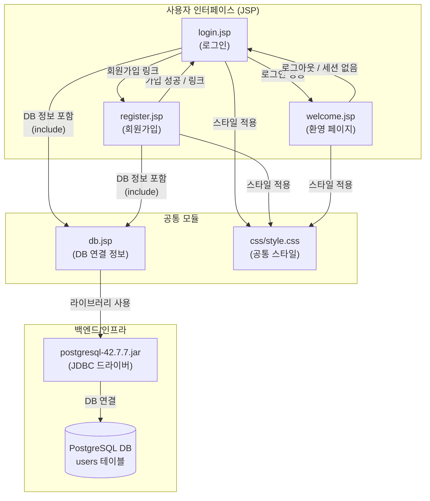

# 프로젝트 의존성 맵

```mermaid
graph TD
    subgraph "사용자 인터페이스 (JSP)"
        A["login.jsp<br/>(로그인)"]
        B["register.jsp<br/>(회원가입)"]
        C["welcome.jsp<br/>(환영 페이지)"]
    end

    subgraph "공통 모듈"
        D["db.jsp<br/>(DB 연결 정보)"]
        E["css/style.css<br/>(공통 스타일)"]
    end

    subgraph "백엔드/인프라"
        F["postgresql-42.7.7.jar<br/>(JDBC 드라이버)"]
        G[("PostgreSQL DB<br/>users 테이블")]
    end

    %% JSP 페이지 간의 흐름
    B --"가입 성공 / 링크"--> A
    A --"로그인 성공"--> C
    A --"회원가입 링크"--> B
    C --"로그아웃 / 세션 없음"--> A

    %% 공통 모듈 의존성
    A --"스타일 적용"--> E
    B --"스타일 적용"--> E
    C --"스타일 적용"--> E

    A --"DB 정보 포함<br/>(include)"--> D
    B --"DB 정보 포함<br/>(include)"--> D

    %% 데이터베이스 의존성
    D --"라이브러리 사용"--> F
    F --"DB 연결"--> G
``` 